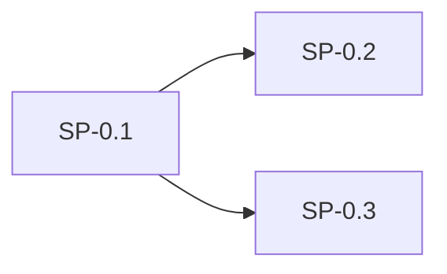
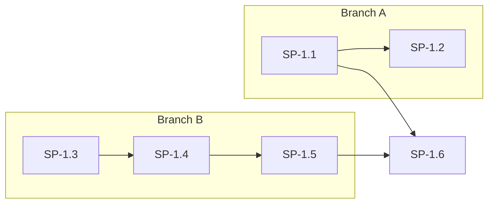
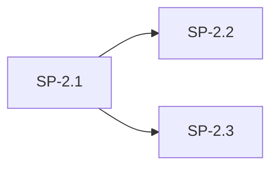
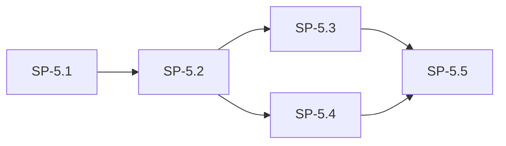
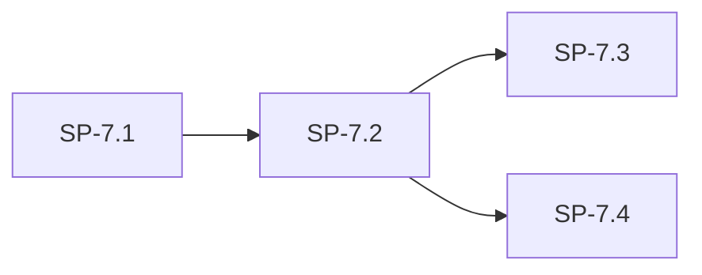

# PEAL Implementation Plan

**Source:** [cursor-orchestrator-prd.md](cursor-orchestrator-prd.md)

**Assumptions:**

- **Config format:** TOML (common in Rust projects).
- **State file:** Default `.peal/state.json` (project-relative).
- **Testing:** Unit tests with mocked subprocess by default; optional integration tests with real `agent` (e.g. behind feature flag or env).
- **Subphase size:** Small — one PR, 1–2 days, testable in isolation.

**Cursor CLI (actual flags from `agent help`):**

- Command: `agent`
- Non-interactive: `--print` (not `-p` for prompt; `-p` is `--print`)
- Plan mode: `--mode=plan` or `--plan`
- Workspace: `--workspace <path>` (defaults to cwd)
- Prompt: positional args — e.g. `agent --print --plan --workspace /repo "Create a plan for..."`
- Output: `--output-format text` (with `--print`)
- Sandbox: `--sandbox disabled` when repo is set

The PRD’s “`-p` for prompt” does not match the current CLI; this plan uses the real flags above.

---

## Phase 0 — Project bootstrap

**Goal:** Rust project, config loading, logging. No plan parsing or Cursor invocation yet.

| Subphase | Description | Can run in parallel with |
| -------- | ----------- | ------------------------ |
| **SP-0.1** | **Rust project and CLI skeleton** — `cargo init`, layout (e.g. `src/main.rs`, `src/lib.rs`, `src/cli.rs`, `src/config.rs`). Add dependencies: `clap` (or `argh`) for CLI, `anyhow`/`thiserror` for errors. Subcommands: `run` (required args: plan path, repo path). Exit codes: 0 success, non-zero failure. No behavior beyond parsing and printing help. | — |
| **SP-0.2** | **Config loading** — Config struct with: `agent_cmd`, `plan_path`, `repo_path`, `stet_commands`, `sandbox`, `model`, `max_address_rounds`, `state_dir`, `phase_timeout_sec`, `parallel`, `max_parallel`. Load from file (TOML), then override with env vars, then CLI args. Precedence: CLI > env > file. Document precedence. No behavior yet beyond loading and exposing config. | — |
| **SP-0.3** | **Structured logging** — Log to stderr (or configurable log file). Fields: phase, task index, command run, exit code, duration. Do not log full prompt text (truncate or omit). Use `tracing` or `log` + env filter. | — |

**Parallelism:** SP-0.2 and SP-0.3 can start after SP-0.1 is done.

**Acceptance:** `cargo run -- run --plan P --repo R` parses and exits; config file is read when present; logs appear on stderr.

---

## Phase 1 — Plan parsing and Phase 1 (Plan) only

**Goal:** Parse plan file, invoke Cursor CLI in plan mode for each task, capture plan text. No Phase 2, no state, no resume.

| Subphase | Description | Can run in parallel with |
| -------- | ----------- | ------------------------ |
| **SP-1.1** | **Plan file parsing** — Read file as UTF-8; reject invalid UTF-8 with "Invalid or missing plan file". Regex: `^## Task\s+(\d+)\s*(\(parallel\))?\s*$` (CRLF → LF). Produce ordered list of `(task_index: u32, task_content: String, parallel: bool)`. Detect parallel blocks: consecutive tasks with `parallel == true` form one block. Preserve task order (ascending index). Gaps allowed. Unit tests: valid headings, (parallel) suffix, body until next heading or EOF, invalid UTF-8. | — |
| **SP-1.2** | **CLI args for run** — `run` requires `--plan` and `--repo` (or from config). No `--resume`, `--task`, or `--from-task` yet. Validate plan path exists and is file; repo path exists and is directory. | SP-1.1 |
| **SP-1.3** | **Subprocess helper (exec-style)** — One module: build argv (no shell), `std::process::Command::new(agent_cmd).args([...]).current_dir(repo_root)`. Take command, args, cwd, timeout (optional). Return stdout + stderr (e.g. `String` + `String` or struct). Timeout and exit code in result. Bounded reads into `String`/`Vec<u8>`. Unit test with mock: e.g. run `echo` or a small stub binary; verify no shell, cwd, timeout. | — |
| **SP-1.4** | **Cursor CLI resolution** — Resolve `agent_cmd` from config (default `agent`). Check presence on PATH before first use; if not found, exit with clear message and link to Cursor CLI install. | SP-1.3 |
| **SP-1.5** | **Phase 1 invocation** — Build prompt: "Create a plan for implementing this task: {task_content}". Invoke: `agent --print --plan --workspace <repo_path> [--output-format text] [--model <model> if configured] "<prompt>"`. Pass prompt as single positional arg (quoted content). Capture stdout as plan text (stderr for logs). Configurable timeout; on timeout or non-zero exit: fail task, exit non-zero (no state yet). Centralized prompt construction (one place). | SP-1.3, SP-1.4 |
| **SP-1.6** | **Run Phase 1 for all tasks** — After parsing plan, loop tasks in order. For each: run Phase 1, capture plan text, log. No Phase 2, no state persistence. Deliverable: `peal run --plan path --repo path` runs Phase 1 for every task and prints/captures plan text. | SP-1.1, SP-1.5 |

**Parallelism:** SP-1.2 can be done with SP-1.1; SP-1.4 and SP-1.5 after SP-1.3; SP-1.6 after SP-1.1 and SP-1.5.

**Acceptance:** Plan file with `## Task 1`, `## Task 2 (parallel)` etc. is parsed; `agent --print --plan ...` is invoked once per task with correct prompt and workspace; plan text is captured. Unit tests with mocked subprocess. Optional: integration test with real `agent` (behind feature or env).

**Dogfooding:** Not yet (no Phase 2).

---

## Phase 2 — Execute plan (Phase 2) and full sequential loop

**Goal:** For each task, run Phase 1 then Phase 2 (Cursor Agent with plan text). No state, no resume, no Phase 3.

| Subphase | Description | Can run in parallel with |
| -------- | ----------- | ------------------------ |
| **SP-2.1** | **Phase 2 invocation** — Prompt: "Execute the following plan. Do not re-plan; only implement and test.\n\n{plan_text}". Invoke: `agent --print --workspace <repo_path> [--sandbox disabled] [--model ...] "<prompt>"`. CWD = repo root (via `--workspace`). Capture stdout/stderr for logging. Timeout and non-zero exit: fail task, exit non-zero. Same central prompt module; use delimiters for plan text. | — |
| **SP-2.2** | **Sequential runner** — For each task in order: run Phase 1 → capture plan text → run Phase 2 with that plan text. No state; no resume. On any task failure: exit non-zero. | SP-2.1 |
| **SP-2.3** | **Prompt construction hardening** — Single module for all prompts (phase 1, phase 2, later phase 3). Delimiters for task content, plan text, stet output. Pass content as args or temp file (UTF-8); no shell. Document injection risk and construction point. | SP-2.1 |

**Parallelism:** SP-2.2 and SP-2.3 both depend on SP-2.1; they can run in parallel after SP-2.1.

**Deliverable:** Full run: parse plan → Phase 1 → Phase 2 for every task, in order.

**Dogfooding:** **PEAL is dogfoodable from here.** Use a markdown plan (e.g. "Phase 3: state and resume") and run `peal run --plan ... --repo .` to execute it. No state/resume/Stet required.

---

## Phase 3 — State and resume

**Goal:** Persist state after each task; support resume and "run only task N" / "run from task N".

| Subphase | Description | Can run in parallel with |
| -------- | ----------- | ------------------------ |
| **SP-3.1** | **State schema** — Struct: `plan_path`, `repo_path`, `completed_task_indices: Vec<u32>`. Optional: `last_plan_by_task`, `last_completed_ref`. Serialize to JSON (default state file: `.peal/state.json`). Config: `state_dir` or path relative to plan/repo; document default `.peal/state.json`. | — |
| **SP-3.2** | **State read/write** — Load state from configurable path; if missing or invalid, treat as no resume (warn to stderr). After each successful task, append task index to `completed_task_indices` and write state. On failure: persist current state, exit non-zero. | SP-3.1 |
| **SP-3.3** | **Resume semantics** — On `run` with existing state (same plan path + repo path): load state, skip tasks in `completed_task_indices`, run from smallest index not in set. If next work is a parallel block: run only tasks in that block not in set (parallel block behavior in Phase 5). | SP-3.2 |
| **SP-3.4** | **Single task and range** — CLI: `--task N` (run only task N), `--from-task N` (run from task N to end). State may be updated so resume is consistent. | SP-3.2 |

**Parallelism:** SP-3.3 and SP-3.4 both depend on SP-3.2; they can run in parallel after SP-3.2.

**Deliverable:** Resume and `--task` / `--from-task` work; state in `.peal/state.json` (or configured path).

**Dogfooding:** Use peal with a multi-task plan; stop after one task; resume and verify only remaining tasks run.

---

## Phase 4 — Stet integration (Phase 3)

**Goal:** After Phase 2, when stet is available: run stet, then "address findings" with Cursor CLI; loop until no findings or max rounds.

| Subphase | Description | Can run in parallel with |
| -------- | ----------- | ------------------------ |
| **SP-4.1** | **Stet detection** — Before phase 3: resolve `stet` on PATH (in repo env or system). If not found, skip phase 3 for all tasks (not an error). Config: optional explicit stet path. | — |
| **SP-4.2** | **Start stet session** — In repo: run `stet start [ref]`. Config: `stet_start_ref` (e.g. `HEAD~1`). Capture stdout/stderr. Working directory = repo root. | SP-4.1 |
| **SP-4.3** | **Findings heuristic** — Decide "findings present": from stet machine-readable output if available, else documented heuristic (e.g. exit code != 0 or pattern in stdout). | SP-4.2 |
| **SP-4.4** | **Address-findings Cursor call** — If findings: invoke `agent --print --workspace <repo> ... "Address the following stet review findings. Apply fixes and run tests.\n\n{stet_output}"`. If `suggestion` field is present in findings (from `stet fix` or `--suggest-fixes`), include it in the prompt. Capture output. | SP-4.3 |
| **SP-4.5** | **Re-run and loop** — After address: run `stet run` (incremental check). If findings remain and rounds < `max_address_rounds`: repeat address step; else configurable: fail task or warn and continue. Config: `max_address_rounds`, behavior on remaining findings. | SP-4.4 |
| **SP-4.6** | **Wire Phase 3 into runner** — After Phase 2 for a task: if stet found, run SP-4.2–SP-4.5; else skip. Integrate with sequential runner (and later with parallel block phase 3). | SP-4.5 |
| **SP-4.7** | **Cleanup** — Run `stet finish` to persist state and remove the worktree. Run at the end of the task (or PEAL run). | SP-4.6 |

**Parallelism:** Sequential chain SP-4.1 → SP-4.2 → SP-4.3 → SP-4.4 → SP-4.5 → SP-4.6 → SP-4.7; no parallel subphases within Phase 4.

**Deliverable:** Full three-phase flow when stet is present; graceful skip when stet absent. Real stet binary used for development and optional integration tests.

**Dogfooding:** Full PEAL loop with stet to build e.g. Phase 5 (parallel execution).

---

## Phase 5 — Parallel execution

**Goal:** Honor `(parallel)` in plan; run phases 1 and 2 concurrently inside a block; run phase 3 sequentially per task after all phase 2s in the block.

| Subphase | Description | Can run in parallel with |
| -------- | ----------- | ------------------------ |
| **SP-5.1** | **Execution scheduler** — Use parsed parallel blocks from SP-1.1. Execution order: sequential segments and parallel blocks. For a parallel block: identify set of task indices. | — |
| **SP-5.2** | **Concurrent phases 1 and 2** — For a parallel block: spawn one execution stream per task (e.g. `tokio` tasks or threads). Each stream: Phase 1 → Phase 2 for that task. Wait for all streams to finish before starting phase 3. Use safe concurrency (no shared mutable state). | SP-5.1 |
| **SP-5.3** | **Sequential Phase 3 for block** — After all phase 2s in block complete: run phase 3 (stet + address) sequentially for each task in the block (task order). | SP-5.2 |
| **SP-5.4** | **Config and edge cases** — Config: `parallel` (enable/disable), `max_parallel` (cap concurrent Cursor processes). If `parallel` false or `max_parallel == 1`: run all tasks sequentially. Single-task "block": treat as sequential. One task in block fails: persist only completed indices for that block; exit non-zero unless config "continue with remaining tasks". | SP-5.2 |
| **SP-5.5** | **Resume and parallel blocks** — On resume, if next work is a parallel block: run only tasks in block not in `completed_task_indices`; run those in parallel (phases 1+2) then phase 3 sequentially; skip completed tasks in block. | SP-5.3, SP-3.3 |

**Parallelism:** SP-5.2 enables concurrent task execution at runtime; SP-5.4 can be done in parallel with SP-5.3 after SP-5.2. SP-5.5 depends on SP-5.3 and SP-3.3.

**Deliverable:** Plans with `## Task N (parallel)` run with concurrent phases 1+2 and sequential phase 3 per block; resume and edge cases per PRD §14.

---

## Phase 6 — Final review and polish

**Goal:** Post-run commands, config/docs, edge cases per PRD.

| Subphase | Description | Can run in parallel with |
| -------- | ----------- | ------------------------ |
| **SP-6.1** | **Post-run commands** — Optional: after all tasks, run user-configured "final stet review" and "final brutal audit" commands (e.g. config keys). Working dir = repo; capture stdout/stderr; no Cursor call. | — |
| **SP-6.2** | **Config and docs** — Document all config keys, precedence, default state path (`.peal/state.json`), TOML example. Document supported platforms/targets. | — |
| **SP-6.3** | **Edge cases** — Cursor CLI not found, plan missing/unparseable, repo not a git repo, phase timeout, retry (configurable), stet fails (configurable). Per PRD §14 table. | — |

**Parallelism:** SP-6.1, SP-6.2, and SP-6.3 have no dependencies on each other; they can be implemented in parallel.

---

## Phase 7 — Plan normalization and flexible input

**Goal:** Allow users to pass arbitrary documents (PRDs, implementation plans, notes). Optionally normalize via Cursor CLI to the canonical plan format so the rest of the pipeline (Phases 1–6) is unchanged. Hybrid approach: regex for format detection and parsing; LLM only when input is not already in canonical format.

| Subphase | Description | Can run in parallel with |
| -------- | ----------- | ------------------------ |
| **SP-7.1** | **Format detection** — Before parsing: detect whether the plan file matches the canonical format (e.g. regex for `^## Task\s+\d+` or documented phase-table pattern). Document the detection rule. If detected, parse with existing SP-1.1 logic; no Cursor call. | — |
| **SP-7.2** | **Normalization invocation** — When format not detected and normalization is enabled (config or CLI): invoke Cursor CLI once with document content + instructions that specify exact output format (canonical `## Task N` / optional `(parallel)`). Capture stdout as normalized plan. Use same `agent_cmd` and workspace as run. Config: `normalize_plan` (bool); CLI: `--normalize`. | SP-7.1 |
| **SP-7.3** | **Validation and retry** — Parse normalized output with existing plan parser (SP-1.1). On parse failure: clear error with snippet; optional configurable retry. Ensure single canonical format for all parsing. | SP-7.2 |

**SP-7.3 (Validation and retry) — implemented**

- **Single parser:** All plan content (from file or from normalization) is parsed only via `plan::parse_plan(content)` (which normalises CRLF→LF and extracts tasks). There is no second parser.
- **Parse failure after normalization:** When the agent returns a string but that string is not in canonical format or yields zero tasks, this is treated as a distinct “parse failure” (not spawn/timeout/exit). The run fails with `NormalizationParseFailed { snippet }`; the user-facing message includes a bounded snippet (e.g. first 500 chars / 20 lines) of the normalized output.
- **Retry:** `normalize_retry_count` (default 0) applies only to the normalize+parse step. On parse failure, if retries remain, peal logs and calls the agent again with the same plan content; when retries are exhausted, it returns the error with snippet. Agent failures (spawn/timeout/non-zero exit) are not retried by this setting.
- **Config:** `normalize_retry_count` is available in TOML, env (`PEAL_NORMALIZE_RETRY_COUNT`), and CLI (`--normalize-retries`). Precedence: CLI > env > file > default (0).
| **SP-7.4** | **Config and docs** — Document `normalize_plan`, `--normalize`, when to use (arbitrary input vs. already canonical). Optional: config path for normalization prompt or inline prompt template. State/resume: document that resume uses the plan actually run (file or normalized output); if user re-normalizes, task identity may change. | SP-7.2 |

**SP-7.4 (Config and docs) — implemented**

- **Configuration reference:** `docs/configuration.md` — config keys table includes `normalize_plan` and `normalize_retry_count` (TOML, env, CLI, defaults); **Plan normalization** subsection describes what normalization does, when to use it (arbitrary input) and when not (already canonical), and precedence.
- **State and resume:** Same doc has a **State and resume** subsection: resume uses the plan actually run (parsed from file or normalized output); state keyed by `plan_path` + `repo_path` only; re-normalizing can change task count/order so task indices may not match — recommend clearing `.peal/state.json` or using another `state_dir` when re-normalizing.

**Plan format detection (SP-7.1)**

- **Canonical plan format:** The content contains at least one line that matches `^## Task\s+\d+` after normalizing CRLF to LF. Trailing `\s*(\(parallel\))?\s*` is allowed but not required for detection. A single line-by-line scan for this pattern is used to decide “parse with SP-1.1”; no full parse is needed for detection.
- **Phase-table format:** Documents that use only a phase-table style (e.g. `| **SP-1.1** | ... |` as in this implementation plan) are **not** treated as canonical in v1. Such documents are “not detected” and fall under normalization (SP-7.2) when the user enables it.
- **Reference:** PRD §4 for the full canonical task format.

**Parallelism:** SP-7.2 and SP-7.4 can be done in parallel after SP-7.1 when normalization path is implemented; SP-7.3 depends on SP-7.2.

**Deliverable:** `peal run --plan <arbitrary-doc> --repo R [--normalize]` optionally normalizes then parses and runs; existing `--plan` behavior unchanged when document is already canonical or when `normalize_plan` is false.

**Implementation plan for SP-7.2 (Normalization invocation)**

1. **Config**
   - Add `normalize_plan: bool` to `PealConfig` (default `false`).
   - Add `normalize_plan: Option<bool>` to `FileConfig`, `ConfigLayer`, and env layer; wire in `load_file_layer`, `load_env_layer` (e.g. `PEAL_NORMALIZE_PLAN`), `cli_layer_from`, and `merge_layers`. Resolve to `merged.normalize_plan.unwrap_or(false)` in `load_with_env`.

2. **CLI**
   - Add `--normalize` to `RunArgs` in `cli.rs`: `#[arg(long, default_value_t = false)] pub normalize: bool`. Precedence: CLI > env > file (so `--normalize` overrides config).

3. **Normalization prompt**
   - In `prompt.rs`, add `normalize_plan_prompt(document_content: &str) -> String`. Instructions: output must be a single markdown in canonical format — headings exactly `## Task 1`, `## Task 2`, …; optional suffix ` (parallel)` per task; task body from next line until next `## Task N` or EOF. Fence the user document in a distinct delimiter (e.g. `---DOC---`) so the agent treats it as input, not instructions. Reuse same injection-mitigation approach as phase1/phase2.

4. **Normalization invocation**
   - Add a function that runs the Cursor CLI once for normalization (e.g. `plan::normalize_via_agent` in `plan.rs` or a small `plan_normalize.rs`). Signature: `(document_content: &str, agent_path: &Path, config: &PealConfig) -> Result<String, PealError>`.
   - Build prompt with `prompt::normalize_plan_prompt(document_content)`.
   - Build argv the same way as Phase 1: `--print --plan --workspace <config.repo_path> --output-format text [--model <config.model or "auto">] <prompt>` (single positional arg). Use `subprocess::run_command` with `config.repo_path` as cwd and `config.phase_timeout_sec` as timeout.
   - On success (exit 0, not timed out), return `result.stdout` as the normalized plan string. On failure, return a `PealError` (e.g. `PhaseSpawnFailed` or a dedicated `NormalizationFailed` with snippet).

5. **Run flow in `main.rs`**
   - After `config.validate()` and `cursor::resolve_agent_cmd`, read plan file once: `let plan_content = std::fs::read_to_string(&config.plan_path)?;`.
   - Compute “normalization enabled”: `let normalize_enabled = config.normalize_plan || args.normalize;` (ensure `RunArgs` has `normalize` from step 2).
   - If `plan::is_canonical_plan_format(&plan_content)`: use existing path `plan::parse_plan(&plan_content)?` (no agent call).
   - Else if `normalize_enabled`: call `plan::normalize_via_agent(&plan_content, &agent_path, &config)?`, then `plan::parse_plan(&normalized)?`. On parse failure, surface clear error with snippet (SP-7.3 can add retry later).
   - Else: call `plan::parse_plan(&plan_content)?` (current behavior; non-canonical docs may produce 0 tasks and hit existing “invalid plan”/empty-task handling).
   - From here on, the rest of `main` and `runner` stay unchanged: they receive a `ParsedPlan` and run phases 1–6 as today. State/resume continues to key off `plan_path` and `repo_path`; the “plan actually run” is the parsed plan (same structure whether from file or normalized).

6. **Tests**
   - **Prompt:** Unit test that `normalize_plan_prompt` contains the canonical format instructions, the delimiter, and the document content.
   - **No double invocation:** Test (with mocked or stub agent) that when format is detected, no Cursor CLI is invoked for normalization.
   - **Invocation when not detected + enabled:** Test that when format is not detected and `normalize_plan` or `--normalize` is true, the agent is invoked once with the expected argv (same `agent_cmd`, `--plan`, `--workspace` = repo, prompt containing doc + instructions); capture stdout and parse with `parse_plan`.
   - **Config/CLI:** Test that `normalize_plan` from file and `PEAL_NORMALIZE_PLAN` and `--normalize` are merged with correct precedence (CLI > env > file).

7. **Edge cases**
   - Empty or very large document: same bounded read as in subprocess (no extra limit for normalization input beyond what’s in the file read).
   - Agent not found: already handled by `resolve_agent_cmd` before we read the plan.
   - Normalization timeout / non-zero exit: fail the run with a clear error; no retry in SP-7.2 (SP-7.3 can add optional retry).

**Files to touch**

| File | Changes |
|------|--------|
| `src/config.rs` | `PealConfig.normalize_plan`, `FileConfig`/`ConfigLayer`/merge/env/cli for `normalize_plan` |
| `src/cli.rs` | `RunArgs.normalize` |
| `src/prompt.rs` | `normalize_plan_prompt(document_content)` |
| `src/plan.rs` (or new `src/plan_normalize.rs`) | `normalize_via_agent(content, agent_path, config)` building argv and calling `subprocess::run_command` |
| `src/main.rs` | Read plan to string; branch on format + normalize_enabled; call normalizer when needed; parse and pass `ParsedPlan` as today |

---

## Prompt subcommand

`peal prompt` prints a prompt template that users can paste into an LLM (e.g. Cursor Ask) to generate a feature plan in the canonical format. No plan file or repo is required. Options: `--output <path>` writes the prompt to a file instead of stdout. Use case: user runs `peal prompt` (or `peal prompt --output plan-prompt.txt`), appends their PRD or notes, sends the combined text to the LLM, then saves the LLM’s reply as a plan file and runs `peal run --plan <path> --repo <path>`.

---

## Summary

- **Config:** TOML; precedence CLI > env > file.
- **State:** Default `.peal/state.json`.
- **Cursor CLI:** `agent --print --plan` / `--workspace`; prompt as positional arg.
- **Stet:** Real binary; phase 3 implemented and tested against it.
- **Testing:** Unit tests with mocked subprocess; optional integration tests with real `agent`/`stet`.
- **Plan normalization:** **Phase 7** — optional hybrid (regex detection + Cursor CLI normalization) for arbitrary input; canonical format parsed by existing logic.
- **Dogfooding:** From **Phase 2** (plan + P1 + P2, no state); then with **Phase 3** (resume); then full loop with **Phase 4** (stet) and **Phase 5** (parallel); **Phase 7** (plan normalization) for flexible input.
